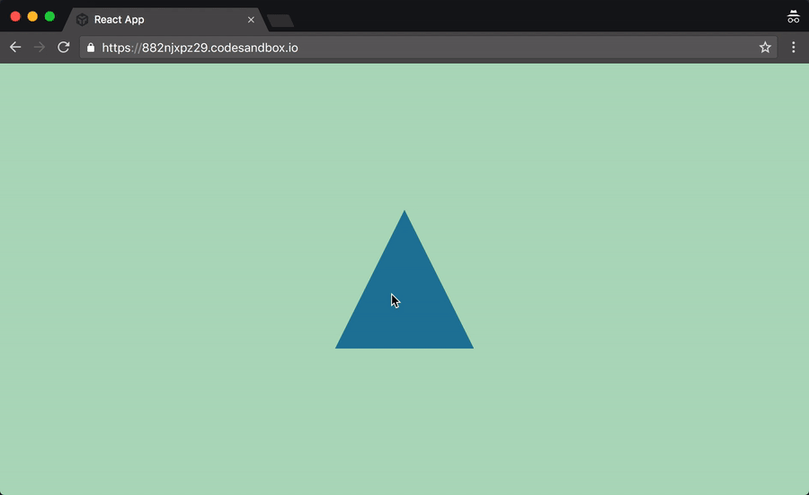
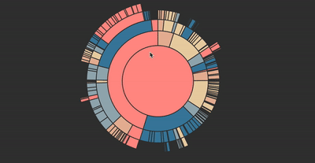

  
  
  

  
  
  

  
  
  

 

      

    npm install react-spring

Endomorphines is a spring physics based animation library for React.

For a more detailed explanation read [Why React needed yet another animation library](https://medium.com/@drcmda/why-react-needed-yet-another-animation-library-introducing-react-spring-8212e424c5ce).

