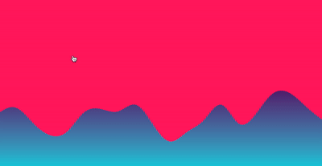
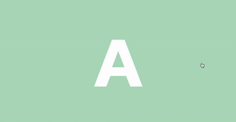

# 🧬 endomorphines 

[](https://www.npmjs.com/package/endomorphines)
[](https://github.com/edgarctop/endomorphines/actions)
[](LICENSE)

---

## ✨ Overview

**endomorphines** is a lightweight, declarative library for handling complex, physics-based animations in React using custom hooks. It is designed to be highly performant, leveraging CSS properties and native browser APIs where possible, making it easy to create smooth, natural motion interfaces.

## 📦 Installation

Install the package using your preferred package manager:

```bash
# Using npm
npm install endomorphines

# Using yarn
yarn add endomorphines
```

## 🚀 Usage

The core of the library is the `useKeyframes` hook, which allows you to define complex animation sequences simply.

### Example: Simple Animation Toggle

```jsx
import React from 'react';
import { useKeyframes } from 'endomorphines';

function BouncingBox() {
  const [isActive, setIsActive] = React.useState(false);

  // Define keyframes and options
  const animationProps = useKeyframes({
    opacity: isActive ? 1 : 0.5,
    y: isActive ? 100 : 0, // Moves 100px on Y-axis when active
    scale: isActive ? 1.2 : 1,
    config: { tension: 170, friction: 26 }, // Custom physics configuration
  }, [isActive]); // Re-run effect when isActive changes

  return (
    <div>
      <div 
        style={{ ...animationProps, width: '100px', height: '100px', background: 'blue' }}
        onClick={() => setIsActive(!isActive)}
      />
      <button onClick={() => setIsActive(!isActive)}>
        Toggle Animation
      </button>
    </div>
  );
}

export default BouncingBox;
```

## 📖 API Reference

### `useKeyframes(styles: object, dependencies: Array<any>)`

The primary hook for defining and running animations.

| Property | Type | Description |
| :--- | :--- | :--- |
| `styles` | `object` | An object where keys are CSS properties (e.g., `opacity`, `x`, `scale`) and values are the target values. Use `config` for animation settings. |
| `dependencies` | `Array` | Standard React dependency array. The animation runs whenever a value in this array changes. |

### `useSpring(value: number, config?: object)`

A simpler hook for animating a single numerical value.


<p align="middle">
  
  
  
</p>
<p align="middle">
  
  
  
</p>
<br />


    npm install react-spring


